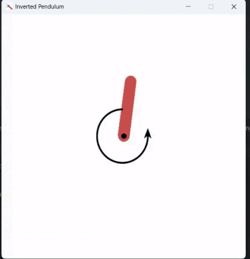

# Reinforcement Learning - Balancing an Inverted Pendulum

Project objective is to address the inverted pendulum swing-up problem, a derivative of the classic control theory challenge. Task is to initiate the pendulum from a randomized position and apply torque to the free end, aiming to swing it into an upright position and maintain balance.

### Final Model - DDQN (Soft Update of Target Network)

